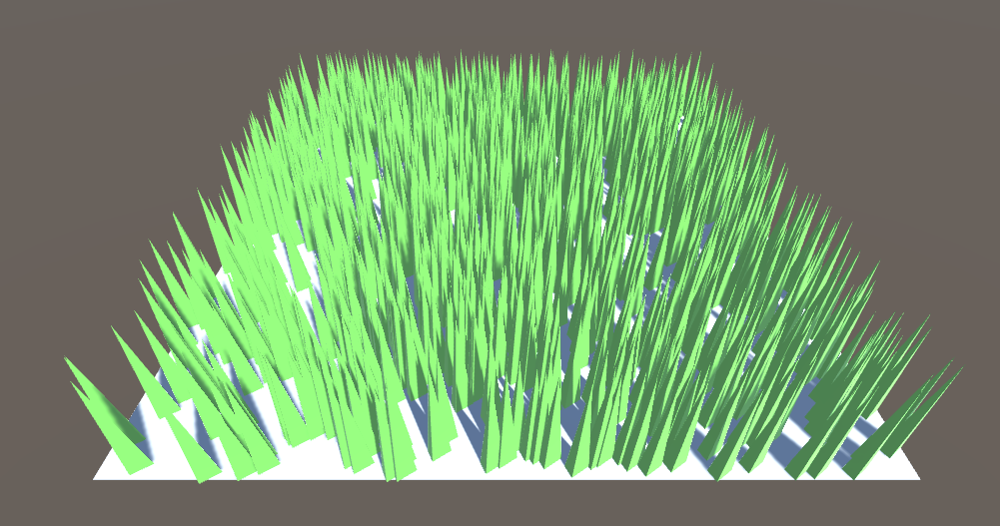

# コンピュートシェーダ

# 経過画像
# 草を生やす
コンピュートシェーダを使わないで1つのメッシュを生やしてみよう 
 

コンピュートシェーダを使わないで沢山のメッシュを生やしてみよう 
 

コンピュートシェーダを使って沢山のメッシュを生やしてみよう 
 

自分で視錐台カリングをしてみよう 
 

# 補足
授業で作成したプロジェクトファイルをforkしたプロジェクトに上げてください。

srcフォルダにプロジェクトのファイルを入れてください。
.gitignore を反映させて、無駄なファイルをアップロードしないようにしてください。

工程に応じて、result+.pngファイルを置いてください(表示されることを確認すること)。

データの著作権に気を付けてください。

翌日以降の提出の際はプルリクを投げてください。
